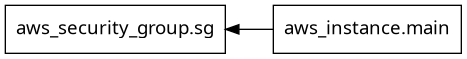

# ImuSafe Terraform

## File Structure

``` bash
├── init_script.sh
├── main.tf
├── outputs.tf
├── README.md
├── terraform_graph
├── terraform_graph.png
├── terraform.tf
├── terraform.tfstate
├── terraform.tfstate.backup
└── variables.tf
```

## Terraform Graph

